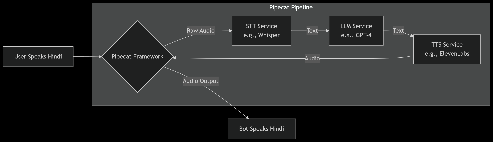

# 🎙️ LLM-Based Voice Call Assistant

A real-time Hindi voice bot prototype for Ola driver support, built with Streamlit and OpenAI's GPT-4, Whisper, and TTS APIs.



## 🌟 Features

- **Real-time Voice Interaction**: Speak in Hindi and get instant voice responses
- **Hindi Language Support**: Full conversation flow in Hindi
- **Streamlit Web Interface**: Beautiful and intuitive web UI
- **OpenAI Integration**: GPT-4 for intelligence, Whisper for speech recognition, TTS for speech synthesis
- **Conversation Management**: Handles predefined support scenario with state tracking
- **Modular Architecture**: Separated services and components for maintainability
- **Multiple Deployment Options**: Docker, AWS EC2, Streamlit Sharing, Heroku

## 🏗️ Architecture

**Data Flow Pipeline:**
```
User Speech (Hindi) → Streamlit Frontend → Whisper STT → GPT-4 Processing → OpenAI TTS → Bot Response (Hindi)
```

## 📁 Project Structure

```
llm_based_voice_call_assist/
├── app.py                      # Main Streamlit application
├── architecture_diagram.png    # System architecture diagram
├── dockerfile                  # Docker containerization
├── requirements.txt            # Python dependencies
├── pyproject.toml             # Python project configuration
├── setup.sh                   # Quick setup script
├── security_setup.sh          # Security configuration
├── voice_bot_config.py        # Bot configuration settings
├── voice_bot_config_helper.py # Configuration utilities
├── voice_bot_audio_report_*.json # Audio test reports
├── mictest.py                 # Microphone testing utility
├── open_aitts.py              # OpenAI TTS testing
├── pipecattest.py             # Pipecat framework testing
├── app/                       # Core application package
│   ├── __init__.py
│   ├── main.py                # Original Pipecat implementation
│   └── services.py            # Service classes and configuration
├── assets/                    # Static assets
│   └── prompts/
│       └── system_prompt.txt  # LLM system prompts
├── tests/                     # Test suite
│   └── __init__.py
└── .streamlit/                # Streamlit configuration
    └── config.toml
```
